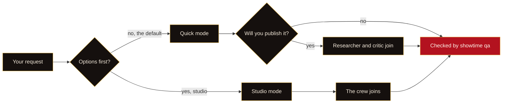

<p align="center">
  <picture>
    <source media="(prefers-color-scheme: dark)" srcset="assets/readme/hero-dark.svg">
    <source media="(prefers-color-scheme: light)" srcset="assets/readme/hero-light.svg">
    
  </picture>
</p>


https://github.com/user-attachments/assets/a11e9613-efd3-490b-a3ec-5583ac65a5d2


<p align="center"><sub>▶ <a href="https://github.com/Mudassir-Kidwai/video-creator-crew-examples/releases/download/examples-media-v1/_launch--launch-16x9.mp4"><b>Watch the 40-second launch film</b></a> (sound on). Every frame is from a real showtime example.</sub><br><sub>Music: “With These Hands” by Scott Buckley, <a href="https://creativecommons.org/licenses/by/4.0/">CC BY 4.0</a> (<a href="https://github.com/Mudassir-Kidwai/video-creator-crew-examples/blob/main/examples/_launch/credits.txt">credits</a>).</sub></p>
<!-- /HERO -->

<p align="center">
  <a href="LICENSE"></a>
  
  
  
  <a href="CHANGELOG.md"></a>
  <a href="#requirements"></a>
  <a href="#requirements"></a>
</p>

<h3 align="center">Ask Claude Code for a video in one sentence.<br>showtime makes it on your own machine.</h3>

<p align="center">
Motion graphics, voice-over, music, sound design, captions, footage editing and platform exports,
with no cloud AI services, no API keys and no uploads.
</p>

<p align="center">
  <a href="#quick-start"><b>Quick start</b></a> ·
  <a href="#now-showing"><b>Gallery</b></a> ·
  <a href="#how-it-works"><b>How it works</b></a> ·
  <a href="#meet-the-crew"><b>The crew</b></a> ·
  <a href="#studio-mode"><b>Studio</b></a> ·
  <a href="#what-you-get"><b>Formats</b></a> ·
  <a href="docs/README.md"><b>Docs</b></a> ·
  <a href="https://mudassir-kidwai.github.io/video-creator-crew/"><b>Site</b></a> ·
  <a href="#requirements"><b>Requirements</b></a>
</p>

<picture>
  <source media="(prefers-color-scheme: dark)" srcset="assets/readme/divider-dark.svg">
  
</picture>

## Quick start

**1. Install the two prerequisites** (details in [Requirements](#requirements)):
[uv](https://docs.astral.sh/uv/) and [Node.js](https://nodejs.org) 24 or 22 LTS (20 or newer works).
Restart Claude Code afterwards so it sees them.

**2. Add showtime to Claude Code:**

```text
/plugin marketplace add Mudassir-Kidwai/video-creator-crew
/plugin install showtime@showtime
```

**3. Ask for a video:**

```text
Make a 20-second launch video for this repo, with a voice-over and upbeat music.
```

The first time, Claude checks what is missing, tells you the download size and time (about 2.9 GB into
`~/.showtime`, usually 3 to 11 minutes; nothing outside that folder changes) and runs setup once you say
yes. After that, a request looks
like this:

<p align="center">
  <picture>
    <source media="(prefers-color-scheme: dark)" srcset="assets/readme/terminal-dark.svg">
    <source media="(prefers-color-scheme: light)" srcset="assets/readme/terminal-light.svg">
    
  </picture>
  <br><sub>An illustration of a session. The card's figures are example 01's; render time depends on your machine.</sub>
</p>

Claude states its assumptions in one line (it asks only when a request is genuinely open), shows you a
first look (stills or a fast draft) before the full-quality render, then checks the result with
`showtime qa`. Every request gets its own folder, `showtime-out/<name>-<timestamp>/`, with `final.mp4`,
`poster.jpg`, `share.txt`, `exports/` and `work/`. Nothing is ever overwritten.

> [!TIP]
> Say **"show me options first"** (or "studio") and Claude opens a local board where you pick a concept,
> a look, a music bed and a storyboard before anything is built. Say **"no crew"** to keep the whole job in
> one session.

<picture>
  <source media="(prefers-color-scheme: dark)" srcset="assets/readme/divider-dark.svg">
  
</picture>

<a id="now-showing"></a>

<p align="center">
  <picture>
    <source media="(prefers-color-scheme: dark)" srcset="assets/readme/marquee-dark.svg">
    <source media="(prefers-color-scheme: light)" srcset="assets/readme/marquee-light.svg">
    
  </picture>
</p>

## Now showing

Every example was made by an agent acting as a user, and ships with its project sources and a README
that tells the story: the request, the assumptions, the commands, what the critic found and what
changed. Click a preview to open the example. Each one has a card with its prompt and links in
[`examples/`](https://github.com/Mudassir-Kidwai/video-creator-crew-examples/blob/main/examples/README.md). Previews are silent; the videos have sound.

#### Data and reports

<table>
<tr>
<td width="33%" valign="top"><a href="https://github.com/Mudassir-Kidwai/video-creator-crew-examples/tree/main/examples/07-data-story"></a><br><b><a href="https://github.com/Mudassir-Kidwai/video-creator-crew-examples/tree/main/examples/07-data-story">Data story</a></b> · 30 s<br><sub>146 years of NASA temperature from a CSV. Every number on screen comes from the data.</sub></td>
<td width="33%" valign="top"><a href="https://github.com/Mudassir-Kidwai/video-creator-crew-examples/tree/main/examples/12-energy-report"></a><br><b><a href="https://github.com/Mudassir-Kidwai/video-creator-crew-examples/tree/main/examples/12-energy-report">Energy report</a></b> · 60 s, narrated<br><sub>How the US power mix changed, from EIA data. Also an <a href="https://github.com/Mudassir-Kidwai/video-creator-crew-examples/blob/main/examples/12-energy-report/us-power-mix.html">HTML video</a>.</sub></td>
<td width="33%" valign="top"><a href="https://github.com/Mudassir-Kidwai/video-creator-crew-examples/tree/main/examples/14-usgs-kilauea-pdf"></a><br><b><a href="https://github.com/Mudassir-Kidwai/video-creator-crew-examples/tree/main/examples/14-usgs-kilauea-pdf">PDF to summary</a></b> · 75 s, English + Spanish<br><sub>A two-page USGS PDF on Kīlauea 2018, with the agency's own footage, stabilized.</sub></td>
</tr>
</table>

#### Explainers

<table>
<tr>
<td width="50%" valign="top"><a href="https://github.com/Mudassir-Kidwai/video-creator-crew-examples/tree/main/examples/02-explainer-heat-pump"></a><br><b><a href="https://github.com/Mudassir-Kidwai/video-creator-crew-examples/tree/main/examples/02-explainer-heat-pump">How a heat pump heats a home</a></b> · 45 s<br><sub>A procedural canvas film, narration fitted to the length, a synthesized score. Also an <a href="https://github.com/Mudassir-Kidwai/video-creator-crew-examples/blob/main/examples/02-explainer-heat-pump/heat-pump.html">HTML video</a>.</sub></td>
<td width="50%" valign="top"><a href="https://github.com/Mudassir-Kidwai/video-creator-crew-examples/tree/main/examples/03-explainer-heat-pump-es"></a><br><b><a href="https://github.com/Mudassir-Kidwai/video-creator-crew-examples/tree/main/examples/03-explainer-heat-pump-es">The same film, in Spanish</a></b> · 51 s<br><sub>Spanish voice and on-screen text, every cut moved to the new narration. Also an <a href="https://github.com/Mudassir-Kidwai/video-creator-crew-examples/blob/main/examples/03-explainer-heat-pump-es/bomba-de-calor.html">HTML video</a>.</sub></td>
</tr>
<tr>
<td width="50%" valign="top"><a href="https://github.com/Mudassir-Kidwai/video-creator-crew-examples/tree/main/examples/13-wikipedia-waggle-dance"></a><br><b><a href="https://github.com/Mudassir-Kidwai/video-creator-crew-examples/tree/main/examples/13-wikipedia-waggle-dance">A Wikipedia article, explained</a></b> · 60 s, English + French<br><sub>The honey bee waggle dance, with real research footage. Also as HTML videos. (CC BY-SA, like its source.)</sub></td>
<td width="50%" valign="top"><a href="https://github.com/Mudassir-Kidwai/video-creator-crew-examples/tree/main/examples/22-manim-circle-area"></a><br><b><a href="https://github.com/Mudassir-Kidwai/video-creator-crew-examples/tree/main/examples/22-manim-circle-area">Why a circle's area is πr²</a></b> · 70 s + Shorts cut<br><sub>A narrated Manim proof with real animated equations.</sub></td>
</tr>
</table>

#### Product and brand

<table>
<tr>
<td width="50%" valign="top"><a href="https://github.com/Mudassir-Kidwai/video-creator-crew-examples/tree/main/examples/01-launch-tidepool"></a><br><b><a href="https://github.com/Mudassir-Kidwai/video-creator-crew-examples/tree/main/examples/01-launch-tidepool">Launch video</a></b> · 20 s<br><sub>A (fictional) notes app: hook cards, its landing page, a scripted recording of the real app.</sub></td>
<td width="50%" valign="top"><a href="https://github.com/Mudassir-Kidwai/video-creator-crew-examples/tree/main/examples/10-launch-showtime"></a><br><b><a href="https://github.com/Mudassir-Kidwai/video-creator-crew-examples/tree/main/examples/10-launch-showtime">showtime's own launch video</a></b> · 30 s + square cut<br><sub>Real renders, real terminal output, narration made on the rendering machine.</sub></td>
</tr>
<tr>
<td width="50%" valign="top"><a href="https://github.com/Mudassir-Kidwai/video-creator-crew-examples/tree/main/examples/17-product-promo-teapot"></a><br><b><a href="https://github.com/Mudassir-Kidwai/video-creator-crew-examples/tree/main/examples/17-product-promo-teapot">Product promo, 1:1</a></b> · 20 s + 6 s bumper<br><sub>A museum's CC0 photos of a Christopher Dresser teapot, only facts from the record. Also an <a href="https://github.com/Mudassir-Kidwai/video-creator-crew-examples/blob/main/examples/17-product-promo-teapot/dresser-teapot.html">HTML video</a>.</sub></td>
<td width="50%" valign="top"><a href="https://github.com/Mudassir-Kidwai/video-creator-crew-examples/tree/main/examples/20-curtain-call-pack"></a><br><b><a href="https://github.com/Mudassir-Kidwai/video-creator-crew-examples/tree/main/examples/20-curtain-call-pack">Brand motion pack</a></b> · sting, lower thirds, stingers<br><sub>A 3D logo sting in three layouts, lower thirds with alpha for an editor, made in studio mode. Also as <a href="https://github.com/Mudassir-Kidwai/video-creator-crew-examples/blob/main/examples/20-curtain-call-pack/html/curtain-call-sting-player.html">HTML</a>.</sub></td>
</tr>
</table>

#### Footage and audio

<table>
<tr>
<td width="50%" valign="top"><a href="https://github.com/Mudassir-Kidwai/video-creator-crew-examples/tree/main/examples/06-footage-edit-nasa"></a><br><b><a href="https://github.com/Mudassir-Kidwai/video-creator-crew-examples/tree/main/examples/06-footage-edit-nasa">Interview, tightened</a></b> · 72 s, 9:16 + 16:9<br><sub>A public-domain NASA interview cut by transcript, face-tracked to vertical, graded and captioned.</sub></td>
<td width="50%" valign="top"><a href="https://github.com/Mudassir-Kidwai/video-creator-crew-examples/tree/main/examples/16-podcast-audiogram"></a><br><b><a href="https://github.com/Mudassir-Kidwai/video-creator-crew-examples/tree/main/examples/16-podcast-audiogram">Podcast audiogram</a></b> · 45 s, 9:16<br><sub>A NASA podcast clip for Reels, TikTok and Shorts, with speaker names and captions.</sub></td>
</tr>
</table>

#### Tutorials

<table>
<tr>
<td width="33%" valign="top"><a href="https://github.com/Mudassir-Kidwai/video-creator-crew-examples/tree/main/examples/04-tutorial-tidepool"></a><br><b><a href="https://github.com/Mudassir-Kidwai/video-creator-crew-examples/tree/main/examples/04-tutorial-tidepool">Recorded tutorial</a></b> · 50 s<br><sub>Recorded from a running app; each click lands on the word that names it.</sub></td>
<td width="33%" valign="top"><a href="https://github.com/Mudassir-Kidwai/video-creator-crew-examples/tree/main/examples/11-tutorial-series-tidepool"></a><br><b><a href="https://github.com/Mudassir-Kidwai/video-creator-crew-examples/tree/main/examples/11-tutorial-series-tidepool">Tutorial series</a></b> · 2 × 90 s<br><sub>Two canvas episodes sharing one kit. Also as <a href="https://github.com/Mudassir-Kidwai/video-creator-crew-examples/blob/main/examples/11-tutorial-series-tidepool/episode-01/final.html">HTML videos</a>.</sub></td>
<td width="33%" valign="top"><a href="https://github.com/Mudassir-Kidwai/video-creator-crew-examples/tree/main/examples/21-tutorial-studio-board"></a><br><b><a href="https://github.com/Mudassir-Kidwai/video-creator-crew-examples/tree/main/examples/21-tutorial-studio-board">Tutorial of a real app</a></b> · 75 s + Shorts cut<br><sub>How to use the showtime studio board, recorded from the real board.</sub></td>
</tr>
</table>

#### Social

<table>
<tr>
<td width="50%" valign="top"><a href="https://github.com/Mudassir-Kidwai/video-creator-crew-examples/tree/main/examples/05-short-vertical"></a><br><b><a href="https://github.com/Mudassir-Kidwai/video-creator-crew-examples/tree/main/examples/05-short-vertical">Vertical short</a></b> · 15 s, 9:16<br><sub>Three shortcuts: a hook in the first second, karaoke captions, effects on every cut.</sub></td>
<td width="50%" valign="top"><a href="https://github.com/Mudassir-Kidwai/video-creator-crew-examples/tree/main/examples/19-travel-slideshow-iceland"></a><br><b><a href="https://github.com/Mudassir-Kidwai/video-creator-crew-examples/tree/main/examples/19-travel-slideshow-iceland">Travel slideshow</a></b> · 45 s + 9:16<br><sub>Eight CC0 photos cut to the music, with a live map inset. The vertical is a re-layout, not a crop.</sub></td>
</tr>
</table>

#### Trailers and montage

<table>
<tr>
<td width="33%" valign="top"><a href="https://github.com/Mudassir-Kidwai/video-creator-crew-examples/tree/main/examples/08-beat-montage"></a><br><b><a href="https://github.com/Mudassir-Kidwai/video-creator-crew-examples/tree/main/examples/08-beat-montage">Beat-synced montage</a></b> · 20 s<br><sub>Public-domain NASA photos cut on the beat of a library track; its CC-BY credit written automatically.</sub></td>
<td width="33%" valign="top"><a href="https://github.com/Mudassir-Kidwai/video-creator-crew-examples/tree/main/examples/09-studio-trailer"></a><br><b><a href="https://github.com/Mudassir-Kidwai/video-creator-crew-examples/tree/main/examples/09-studio-trailer">Studio-mode trailer</a></b> · 20 s<br><sub>Four concepts on a local board, picks and notes, a storyboard and an animatic, then the final.</sub></td>
<td width="33%" valign="top"><a href="https://github.com/Mudassir-Kidwai/video-creator-crew-examples/tree/main/examples/18-book-trailer-war-of-the-worlds"></a><br><b><a href="https://github.com/Mudassir-Kidwai/video-creator-crew-examples/tree/main/examples/18-book-trailer-war-of-the-worlds">Book trailer</a></b> · 30 s + 15 s vertical teaser<br><sub>The War of the Worlds, from public-domain illustrations and lines from the novel.</sub></td>
</tr>
</table>

#### For developers

<table>
<tr>
<td width="50%" valign="top"><a href="https://github.com/Mudassir-Kidwai/video-creator-crew-examples/tree/main/examples/15-oss-release-black"></a></td>
<td width="50%" valign="top"><b><a href="https://github.com/Mudassir-Kidwai/video-creator-crew-examples/tree/main/examples/15-oss-release-black">Open-source release video</a></b> · 35 s, no voice<br><sub>What changes in people's code with Black 26.1.0's 2026 stable style: real before-and-after diffs, the install line and the changelog. Point showtime at a repo, a pull request or a changelog and it makes the same kind of video. (An unofficial summary, made as an example.)</sub></td>
</tr>
</table>


<p align="center"><sub>All 22 examples, with their projects and full-quality videos, live in <a href="https://github.com/Mudassir-Kidwai/video-creator-crew-examples"><b>showtime-examples</b></a>.</sub></p>

> [!NOTE]
> The **HTML videos** are single files you can open in any browser, offline: the same frames as the
> MP4, a player with chapters, keyboard shortcuts and links to a moment, and no network requests. Make
> one from any project with `showtime export html`. On GitHub, download the file to play it.

<details>
<summary><b>The 22 prompts behind the examples</b>: copy one into Claude Code</summary>

| # | Prompt |
|---|---|
| [01](https://github.com/Mudassir-Kidwai/video-creator-crew-examples/tree/main/examples/01-launch-tidepool) | Make a 20-second launch video for Tidepool from its landing page and the real app UI, with music and subtle sound effects, no voice-over. |
| [02](https://github.com/Mudassir-Kidwai/video-creator-crew-examples/tree/main/examples/02-explainer-heat-pump) | Make a 45-second explainer video with voiceover about how a heat pump heats a home in winter. |
| [03](https://github.com/Mudassir-Kidwai/video-creator-crew-examples/tree/main/examples/03-explainer-heat-pump-es) | Now make the Spanish version of the heat pump explainer. |
| [04](https://github.com/Mudassir-Kidwai/video-creator-crew-examples/tree/main/examples/04-tutorial-tidepool) | Make a 40-60 second tutorial showing how to create a note, tag it and find it with search in Tidepool. |
| [05](https://github.com/Mudassir-Kidwai/video-creator-crew-examples/tree/main/examples/05-short-vertical) | Make a 15-second vertical short for Reels: 3 keyboard shortcuts that make Tidepool fast. |
| [06](https://github.com/Mudassir-Kidwai/video-creator-crew-examples/tree/main/examples/06-footage-edit-nasa) | Cut the ums and long pauses out of this interview clip, add captions, and make a vertical 9:16 version for Reels plus a 16:9 version. |
| [07](https://github.com/Mudassir-Kidwai/video-creator-crew-examples/tree/main/examples/07-data-story) | Make a 30-second data story from this CSV. |
| [08](https://github.com/Mudassir-Kidwai/video-creator-crew-examples/tree/main/examples/08-beat-montage) | Make a 20-second beat-synced montage of space photos. |
| [09](https://github.com/Mudassir-Kidwai/video-creator-crew-examples/tree/main/examples/09-studio-trailer) | Let's brainstorm a trailer for Tidepool first. Show me options. |
| [10](https://github.com/Mudassir-Kidwai/video-creator-crew-examples/tree/main/examples/10-launch-showtime) | Make a 30-second launch video for showtime itself. Show real things: real renders, real terminal commands, the studio board. Plus a square cut-down. |
| [11](https://github.com/Mudassir-Kidwai/video-creator-crew-examples/tree/main/examples/11-tutorial-series-tidepool) | Build a two-episode tutorial series for Tidepool as canvas films: "Capture a note in seconds" and "Find anything with search and tags". |
| [12](https://github.com/Mudassir-Kidwai/video-creator-crew-examples/tree/main/examples/12-energy-report) | Make a one-minute narrated video from the EIA's electricity generation data showing how the US power mix changed: coal, gas, wind and solar. |
| [13](https://github.com/Mudassir-Kidwai/video-creator-crew-examples/tree/main/examples/13-wikipedia-waggle-dance) | Turn the Wikipedia article on the waggle dance into a 60-second animated explainer, and make a French version too. |
| [14](https://github.com/Mudassir-Kidwai/video-creator-crew-examples/tree/main/examples/14-usgs-kilauea-pdf) | Here's a USGS PDF about the 2018 Kīlauea eruption. Make a 75-second narrated summary video, and a Spanish version with subtitles. |
| [15](https://github.com/Mudassir-Kidwai/video-creator-crew-examples/tree/main/examples/15-oss-release-black) | Make a 35-second what's-new video for Black 26.1.0: show what the 2026 stable style actually changes in people's code. |
| [16](https://github.com/Mudassir-Kidwai/video-creator-crew-examples/tree/main/examples/16-podcast-audiogram) | Cut a 40-second vertical audiogram from this NASA podcast episode for Reels, TikTok and Shorts, with captions and the speakers' names. |
| [17](https://github.com/Mudassir-Kidwai/video-creator-crew-examples/tree/main/examples/17-product-promo-teapot) | Make a 20-second square product promo from these museum photos of Christopher Dresser's teapot: sleek, but only facts from the museum record. Plus a 6-second bumper. |
| [18](https://github.com/Mudassir-Kidwai/video-creator-crew-examples/tree/main/examples/18-book-trailer-war-of-the-worlds) | Make a 30-second cinematic book trailer for The War of the Worlds using public-domain illustrations and lines from the novel, plus a vertical 15-second teaser. |
| [19](https://github.com/Mudassir-Kidwai/video-creator-crew-examples/tree/main/examples/19-travel-slideshow-iceland) | Make a 45-second travel slideshow of an Iceland ring-road trip from these CC0 photos, cut to the music, with a little map showing where each place is. Also a vertical version for Reels. |
| [20](https://github.com/Mudassir-Kidwai/video-creator-crew-examples/tree/main/examples/20-curtain-call-pack) | Using our brand, give me a motion pack: a 3D logo sting in wide, square and vertical, four lower thirds my editor can drop into Premiere, and a couple of branded transitions. Show me concepts first. |
| [21](https://github.com/Mudassir-Kidwai/video-creator-crew-examples/tree/main/examples/21-tutorial-studio-board) | Record a 75-second narrated tutorial showing how to use the showtime studio board: open it, compare concepts, react, pick one, and send feedback. And a vertical cut for Shorts. |
| [22](https://github.com/Mudassir-Kidwai/video-creator-crew-examples/tree/main/examples/22-manim-circle-area) | Make a narrated 70-second math explainer showing why the area of a circle is pi r squared, with real animated equations. |

</details>

<picture>
  <source media="(prefers-color-scheme: dark)" srcset="assets/readme/divider-dark.svg">
  
</picture>

## How it works

<p align="center"><picture>
  <source media="(prefers-color-scheme: dark)" srcset="assets/readme/diagrams/pipeline-dark.svg">
  
</picture></p>

Motion graphics are written as HTML, CSS and canvas and rendered frame-exactly in headless Chrome: every
frame is a pure function of time, so a render, its preview and its HTML video show the same picture.
Math scenes use Manim, and real footage is cut by transcript with ffmpeg.

### What runs where

<p align="center"><picture>
  <source media="(prefers-color-scheme: dark)" srcset="assets/readme/diagrams/runs-where-dark.svg">
  
</picture></p>

showtime adds no cloud service of its own: no API keys, no accounts, nothing you make is uploaded.
Every model and tool is downloaded once into `~/.showtime`. After that it goes online only when you ask
for something from the web: public-archive media search (Openverse, Wikimedia Commons, NASA) and website
capture fetch pages and files, and send nothing of yours.

<!-- ============================================================================================
BENCHMARK SECTION (hidden until the benchmark is published; no claims before then).
To publish: fill the numbers from benchmarks/, render the two charts into assets/readme/benchmark/
(light + dark, same style as assets/readme/diagrams/), uncomment the block and add
<a href="#benchmark"><b>Benchmark</b></a> to the navigation line under the hero.

## Benchmark

<picture>
  <source media="(prefers-color-scheme: dark)" srcset="assets/readme/benchmark/results-dark.svg">
  
</picture>

One or two sentences: what the benchmark measures, how many tasks, who judged and how (blind or not).

| Task set | showtime | Baseline A | Baseline B |
|---|---|---|---|
| (tasks) | (score) | (score) | (score) |

How it was run, and how to rerun it: [`benchmarks/`](benchmarks/). Every number above is reproducible
from the files there.
============================================================================================= -->

<picture>
  <source media="(prefers-color-scheme: dark)" srcset="assets/readme/divider-dark.svg">
  
</picture>

## Meet the crew

Claude is the director. For studio work and videos you will publish, it can hand parts of the job to
**ten specialist sub-agents** that ship with the plugin. They are optional: a quick video uses none of
them, except a researcher and a critic when you say it will be published (and scene builders for long
videos). Each member gets a written brief, works only in its own folder, never asks you anything, never
uploads, and reports back with a short status.

<p align="center"><picture>
  <source media="(prefers-color-scheme: dark)" srcset="assets/readme/crew/cast-dark.svg">
  
</picture></p>

### Who hands what to whom

<p align="center"><picture>
  <source media="(prefers-color-scheme: dark)" srcset="assets/readme/diagrams/crew-handoff-dark.svg">
  
</picture></p>

**Let Claude cast it** (the usual way). Studio mode brings in the company; for a quick video you will
publish, Claude adds the researcher and the critic on its own. Say **"no crew"** to keep everything in
one session.

```text
Let's make a launch trailer for this repo. Show me options first.
```

**Or call one member yourself**, by name:

```text
@agent-showtime:researcher check the claims in narration.md against the README
@agent-showtime:critic showtime-out/<job>/review/round-1/CRITIC.md
```

The agents live in [`agents/`](agents/); their briefs, in
[`skills/showtime/references/crew/`](skills/showtime/references/crew/), work on any agent host, and the
[crew guide](skills/showtime/references/crew.md) has the dispatch rules.

<picture>
  <source media="(prefers-color-scheme: dark)" srcset="assets/readme/divider-dark.svg">
  
</picture>

## Studio mode

Quick mode is the default: one request in, a video out. Studio is opt-in ("show me options first").



Quick mode is one sentence in and a video out; studio mode opens a local board first, then builds.

In studio you talk about facts and goals in chat; everything about look, sound and timing is shown on a
board, a local page served on `127.0.0.1` with a token, with lettered options, one recommendation and
buttons you click.

<p align="center"><picture>
  <source media="(prefers-color-scheme: dark)" srcset="assets/readme/diagrams/studio-dark.svg">
  
</picture></p>

See [example 09](https://github.com/Mudassir-Kidwai/video-creator-crew-examples/tree/main/examples/09-studio-trailer) and [example 21](https://github.com/Mudassir-Kidwai/video-creator-crew-examples/tree/main/examples/21-tutorial-studio-board), which is
a tutorial of the board itself.

<picture>
  <source media="(prefers-color-scheme: dark)" srcset="assets/readme/divider-dark.svg">
  
</picture>

## What you get

<p align="center"><picture>
  <source media="(prefers-color-scheme: dark)" srcset="assets/readme/diagrams/formats-dark.svg">
  
</picture></p>

### HTML videos

`showtime export html` writes one file that plays offline in any browser, with the same frames as the
render. Press <kbd>?</kbd> in the player for the key map.

<p align="center"><picture>
  <source media="(prefers-color-scheme: dark)" srcset="assets/readme/diagrams/html-anatomy-dark.svg">
  
</picture></p>

<details>
<summary><b>The player's keys</b></summary>

| Keys | Action |
|---|---|
| <kbd>Space</kbd> or <kbd>K</kbd> | play / pause |
| <kbd>←</kbd> / <kbd>→</kbd> | back / forward 1 s |
| <kbd>,</kbd> / <kbd>.</kbd> | one frame back / forward |
| <kbd>J</kbd> / <kbd>L</kbd> | back / forward 5 s |
| <kbd>1</kbd> to <kbd>9</kbd> | jump to a chapter |
| <kbd>[</kbd> / <kbd>]</kbd> | previous / next chapter |
| <kbd>M</kbd> | mute |
| <kbd>F</kbd> | fullscreen |
| <kbd>C</kbd> | copy a link to this moment |

</details>

## What is in the box

<table>
<tr>
<td width="33%" valign="top"><picture><source media="(prefers-color-scheme: dark)" srcset="assets/readme/icons/voice-dark.svg"></picture><br><b>Voice-over</b><br><sub>Kokoro, Piper and Supertonic voices, English, Spanish and 30+ more languages, with exact word timings for captions and kinetic type.</sub></td>
<td width="33%" valign="top"><picture><source media="(prefers-color-scheme: dark)" srcset="assets/readme/icons/music-dark.svg"></picture><br><b>Music and sound</b><br><sub>A procedural composer that hits exact lengths, 56 synthesized effect types, a library of 1,334 permissively licensed sounds, beat grids, ducking, mastering.</sub></td>
<td width="33%" valign="top"><picture><source media="(prefers-color-scheme: dark)" srcset="assets/readme/icons/captions-dark.svg"></picture><br><b>Captions</b><br><sub>Five styles, burned in or as SRT/VTT, placed inside each platform's safe zone; karaoke from the voice's word times.</sub></td>
</tr>
<tr>
<td width="33%" valign="top"><picture><source media="(prefers-color-scheme: dark)" srcset="assets/readme/icons/footage-dark.svg"></picture><br><b>Footage editing</b><br><sub>Word-level local transcripts; cut fillers and pauses by editing text; speakers, scenes, face-tracked 9:16, stabilize, denoise, grade.</sub></td>
<td width="33%" valign="top"><picture><source media="(prefers-color-scheme: dark)" srcset="assets/readme/icons/manim-dark.svg"></picture><br><b>Math with Manim</b><br><sub>Equations, proofs, graphs and grid transforms, timed to the narration, as an optional extra.</sub></td>
<td width="33%" valign="top"><picture><source media="(prefers-color-scheme: dark)" srcset="assets/readme/icons/studio-dark.svg"></picture><br><b>Studio boards</b><br><sub>Concepts, style frames, music beds, a storyboard and an animatic on local pages you click through; picks are logged.</sub></td>
</tr>
<tr>
<td width="33%" valign="top"><picture><source media="(prefers-color-scheme: dark)" srcset="assets/readme/icons/crew-dark.svg"></picture><br><b>A crew of ten</b><br><sub>Optional specialist sub-agents from creative director to critic; Claude stays the director and the only one who talks to you.</sub></td>
<td width="33%" valign="top"><picture><source media="(prefers-color-scheme: dark)" srcset="assets/readme/icons/html-dark.svg"></picture><br><b>HTML videos</b><br><sub>One self-contained file per video: chapters, keyboard control, links to a moment, zero network requests.</sub></td>
<td width="33%" valign="top"><picture><source media="(prefers-color-scheme: dark)" srcset="assets/readme/icons/qa-dark.svg"></picture><br><b>QA before done</b><br><sub>Pre-render checks, then <code>showtime qa</code> on the final: loudness, black or frozen frames, captions, platform specs.</sub></td>
</tr>
</table>

Also: 20 motion components, 23 transitions (CSS and WebGL) and 6 themes, website capture (screenshots, copy, brand colours and fonts), scripted app recordings with smooth
auto-zoom, cursor and keycaps, PDF import, CSV and JSON to charts, a brand kit, posters baked into frame
0, exports for YouTube, X, LinkedIn, Reels, TikTok, Shorts and square feeds, README loops (animated WebP
and GIF, like the previews on this page), and credits written automatically when an asset needs
attribution.

<details>
<summary><b>Every command</b></summary>

`showtime --help` lists them grouped, with examples; `showtime <command> --help` has the details.

| Group | Commands |
|---|---|
| Make | `new` (templates: dom, film, short, tutorial, data, series, manim), `retime`, `data`, `preview`, `render`, `export`, `check`, `snap`, `score`, `motion`, `code`, `server`, `manim` |
| Audio | `audio compose`, `sfx`, `lib`, `beats`, `fit`, `mix`, `meter`, `master` |
| Voice | `voice say`, `voice script` (narration with word timings, fitted to a length) |
| Footage | `transcribe`, `pack`, `edit`, `captions`, `footage`, `autozoom` |
| Capture and assets | `site`, `demo`, `doc`, `assets` |
| Studio | `studio`, `brand` |
| Job and QA | `status`, `qa`, `review-pack`, `job`, `clean` |
| Deliver | `deliver` (posters, platform exports, thumbnails, README loops) |
| Setup | `setup`, `doctor`, `report`, `paths`, `version`, `help` |
| More | `series` (a tutorial series sharing one kit) |

```bash
showtime new dom my-video --duration 20     # a project from a template
showtime voice script my-video/narration.md -o my-video/voice --fit 18   # local narration, fitted to 18 s
showtime retime my-video --from-voice my-video/voice/timeline.json         # scenes follow the narration
showtime data import signups.csv my-video --x month --y signups --scene bars   # a CSV becomes a chart
showtime preview my-video                    # live player with scrubber and audio
showtime render my-video --preview           # fast draft
showtime render my-video -o final.mp4        # full quality
showtime qa final.mp4                        # PASS/WARN/FAIL: loudness, black/frozen frames, captions, platform
showtime deliver exports final.mp4 --targets youtube,reels,square
showtime export html my-video                # a single-file interactive HTML video
```

</details>

<details>
<summary><b>The audio toolkit</b></summary>

Everything is local and license-gated: no sample leaves your machine, and an asset that needs
attribution writes itself into `credits.txt`.

| Command | What it does |
|---|---|
| `audio compose` | procedural music to an exact length in 18 styles, with stems, MIDI and a beat map; restrained beds for explainers and data, livelier styles on request |
| `audio sfx` | 56 synthesized effect types (whooshes, hits, UI clicks, risers), with the hit time printed |
| `audio lib` | the local library, 1,334 sounds: CC0 effects and ambiences, CC-BY music beds credited automatically, and beds rendered on your machine |
| `audio beats` | beats, downbeats, onsets, energy, sections and key, so cuts land on the music |
| `audio fit` | loops or trims music to a length on bar lines |
| `audio mix` | one mix file: ducking under the voice, effects aligned to hits, loudness |
| `audio meter`, `audio master` | LUFS, true peak and loudness range; mastering to -14 LUFS / -1 dBTP by default |

</details>

<details>
<summary><b>Math with Manim</b></summary>

`showtime manim new|render|check|cues` makes equations, proofs, graphs and grid transforms with Manim
Community (the `manim` extra; LaTeX is needed only for equations), and times them to the narration.
[Example 22](https://github.com/Mudassir-Kidwai/video-creator-crew-examples/tree/main/examples/22-manim-circle-area) cuts a circle into rings, unrolls them into a triangle and
lands on

$$A = \tfrac{1}{2} \cdot 2\pi r \cdot r = \pi r^2$$

with a vertical cut for Shorts from the same scenes. An optional OpenGL engine (the `manimgl` extra) runs
scene files written for it.

</details>

<picture>
  <source media="(prefers-color-scheme: dark)" srcset="assets/readme/divider-dark.svg">
  
</picture>

## Requirements

showtime is built for macOS (Apple Silicon and Intel), Windows 10/11 and Linux (x86_64 and arm64).
So far it has been **tested end to end on an Intel Mac, Linux x86_64 (Ubuntu 24.04) and Windows x64 (Windows Server 2025, as a standard user)**: setup, doctor, a voiced render with qa, HTML export, transcription, captions, the MCP server and the fast test suite.
**Apple Silicon is tested in CI** on GitHub's macOS 14 arm64 runners: the core setup and the fast test suite, which includes real renders. A run on a physical Apple Silicon Mac is still welcome.
Windows 10/11 desktop editions run the same code as Windows Server but have not been run on a real machine yet, nor has Linux arm64.
The CI workflow runs the fast test suite on Linux x64, Windows x64, Apple Silicon and Intel Macs. Expect rough edges on the untested
platforms, and please [open an issue](https://github.com/Mudassir-Kidwai/video-creator-crew/issues) when something breaks.

| | macOS 14+ | Windows 10/11 (x64) | Linux (glibc 2.28+: Ubuntu 20.04+, Debian 10+) |
|---|---|---|---|
| Status | Intel: tested<br>Apple Silicon: tested in CI (macOS 14 arm64) | tested on Server 2025 x64; 10/11 not yet run | x86_64: tested<br>arm64: not yet run |
| [uv](https://docs.astral.sh/uv/getting-started/installation/) | install script | install script or winget | install script |
| [Node.js](https://nodejs.org) 24 or 22 LTS (20+) | installer | installer or winget | fnm or NodeSource |

Chrome, Edge or Chromium is found automatically; if none is installed, setup downloads Playwright's
Chromium. Disk: about 2.9 GB for the default install plus about 249 MB for the audio library.

<details>
<summary><b>Install commands for uv and Node.js</b></summary>

macOS and Linux:

```bash
curl -LsSf https://astral.sh/uv/install.sh | sh
# Node.js: the installer from nodejs.org (macOS), or on Linux fnm (distribution packages are often older than 20):
curl -fsSL https://fnm.vercel.app/install | bash && fnm install 22
```

Windows (PowerShell):

```powershell
winget install --id=astral-sh.uv -e      # or: powershell -ExecutionPolicy ByPass -c "irm https://astral.sh/uv/install.ps1 | iex"
winget install OpenJS.NodeJS.LTS --source winget   # or the installer from nodejs.org
```

On Linux, if the browser does not start, install Chromium's system libraries once (after setup):
`sudo "$(command -v node)" ~/.showtime/node/node_modules/playwright/cli.js install-deps chromium`.
[NodeSource](https://github.com/nodesource/distributions) packages work too.

</details>

ffmpeg is downloaded as a static build, so a system ffmpeg is not needed. Installing uv or Node.js
updates `PATH` for new terminals only: **restart Claude Code afterwards** (showtime also looks in the
installers' default folders if the new `PATH` has not reached it yet).

<details>
<summary><b>Setup from a terminal, and what it installs</b></summary>

The first time showtime is used, Claude tells you the size and time and runs the setup once you agree. The first time a video needs library
music or effects, Claude fetches the audio library (`showtime audio lib fetch`: about 249 MB, about 10–15 min). To run
setup yourself, use a clone (both share `~/.showtime`).

macOS and Linux (bash, zsh):

```bash
git clone https://github.com/Mudassir-Kidwai/video-creator-crew
showtime/skills/showtime/bin/showtime setup
showtime/skills/showtime/bin/showtime doctor
showtime/skills/showtime/bin/showtime audio lib fetch
```

Windows PowerShell (`showtime.cmd` also works from cmd; `showtime.ps1` is there too):

```powershell
git clone https://github.com/Mudassir-Kidwai/video-creator-crew
& .\showtime\skills\showtime\bin\showtime.cmd setup
& .\showtime\skills\showtime\bin\showtime.cmd doctor
& .\showtime\skills\showtime\bin\showtime.cmd audio lib fetch
```

To type `showtime` anywhere, add `skills/showtime/bin` to your `PATH`. On Windows that runs `showtime.cmd`
(from cmd or PowerShell); call `showtime.ps1` directly only where the PowerShell execution policy allows
scripts.

| In `~/.showtime` (move it with `SHOWTIME_HOME`) | Contents |
|---|---|
| `bin/` | static `ffmpeg` / `ffprobe` for your OS and CPU |
| `venv/` | Python 3.12 environment with pinned packages |
| `node/` | pinned Node packages: Playwright, animation, charts, math, icons, fonts |
| `browsers/` | Playwright Chromium, only when no Chrome/Edge/Chromium is installed |
| `models/` | voices, transcription, face detection and denoise models |
| `soundfonts/` | the FluidR3Mono General MIDI bank (MIT) and its license |
| `library/` | the audio library: CC0 effects and ambiences, CC-BY music beds (credited automatically), plus effects and beds rendered locally; `showtime audio lib fetch --tier extended` adds about 1 GB more music |

Downloads resume after an interruption and are skipped when already present, so re-running setup is
always safe. Setup's downloads, the optional extras, the core audio library and the models fetched on
first use (the English aligner, Piper voices) are pinned by URL, size and SHA-256. Two are not pinned
yet: the extended audio-library tier records each file's SHA-256 on its first download and verifies
every re-download against it (trust on first use), and the background-removal engine used outside
macOS (rembg, a pinned package version) fetches its model with its own downloader. Features that need
an optional extra say so and print the exact command; nothing is installed behind your back.

```bash
showtime setup --list                     # tiers, extras and their sizes
showtime setup --estimate                 # what this run would download, and how long it takes
showtime setup --with asr-turbo,diarize   # add extras (keeps what is already installed)
showtime setup --tier full                # core + the common extras
```

| Extra | What it adds |
|---|---|
| `asr-turbo` | Whisper large-v3-turbo, the most accurate multilingual transcripts |
| `parakeet` | Parakeet-TDT 0.6B, very fast English transcription that keeps fillers |
| `diarize` | speaker labels for interviews and podcasts |
| `events` | audio event tags (laughter, applause, music) |
| `supertonic` | Supertonic 3 voices (Spanish and 30 more languages) |
| `sf-generaluser` | the GeneralUser GS SoundFont, a richer General MIDI bank (its own free license) |
| `sf-musescore` | the MuseScore General orchestral SoundFont |
| `deepfilter` | DeepFilterNet3 speech denoiser |
| `rife` | RIFE frame interpolation (GPU, Vulkan) |
| `chromium` | Playwright's Chromium even when Chrome is installed |
| `manim` | Manim Community for math and diagram animation, `showtime manim` (needs cairo/pango on macOS/Linux; LaTeX only for equations) |
| `manimgl` | ManimGL 1.7.2, an optional OpenGL engine for scene files written for it (own venv; needs OpenGL 3.3; a Linux server without a display also needs `xvfb`) |
| `musicgen` | MusicGen draft music; its weights are **non-commercial**, so outputs are labelled |

</details>

<details>
<summary><b>What showtime runs and downloads</b>: every download, and what goes over the network</summary>

**What runs.** Installing the plugin downloads this repository and nothing else. It adds the `showtime`
skill (Claude runs `skills/showtime/bin/showtime`, a Python and Node command line, in your terminal), a
local MCP server (`node skills/showtime/mcp/server.mjs` over stdio; it makes no network calls of its own), a
progress monitor while the skill is in use (`node skills/showtime/mcp/progress-monitor.mjs`, which reads
`~/.showtime/logs/progress.jsonl`), and ten optional sub-agents. No hooks. Setup runs only after Claude has
told you the size and time and you agree, or when you run it yourself. Files go to `~/.showtime` (or
`SHOWTIME_HOME`, or the plugin's `home` setting) and each video to `showtime-out/<slug>-<timestamp>/` in
your project.

**Setup downloads** (the default `core` tier, about 2.9 GB). Every model and ffmpeg file is checked against
a size and SHA-256 pinned in `skills/showtime/setup/manifest.json`:

| What | From | Size |
|---|---|---|
| ffmpeg 9.0.2 and ffprobe, static builds (GPL), skipped when a capable ffmpeg is already installed | macOS Intel: evermeet.cx (fallback ffmpeg.martin-riedl.de); Apple Silicon: ffmpeg.martin-riedl.de; Windows: gyan.dev builds from github.com/GyanD/codexffmpeg (fallback github.com/BtbN/FFmpeg-Builds); Linux: github.com/BtbN/FFmpeg-Builds (x64 fallback ffmpeg.martin-riedl.de) | 52 to 194 MB, one build |
| Python packages, in a Python 3.12 environment (uv downloads Python 3.12 if you do not have it) | PyPI through uv; versions pinned in `setup/requirements.txt` | about 1.5 GB installed |
| Node packages: Playwright, anime.js, D3, three.js, KaTeX, Shiki, Lottie, icon sets and 16 Fontsource font packages | registry.npmjs.org, `npm ci` from `setup/package-lock.json` (integrity hashes, no install scripts) | about 250 MB installed |
| Kokoro 82M text-to-speech, two model files and the voices (Apache-2.0) | huggingface.co/onnx-community, github.com/thewh1teagle/kokoro-onnx | 679 MB |
| Whisper small.en transcription (MIT) | huggingface.co/Systran | 486 MB |
| Silero VAD (MIT), the YuNet face detector (MIT), arnndn denoise models, the FluidR3Mono SoundFont (MIT) | github.com/k2-fsa/sherpa-onnx, github.com/opencv/opencv_zoo, raw.githubusercontent.com (richardpl/arnndn-models, musescore/MuseScore), pinned to a release or commit | 27 MB |
| Chromium, only when no Chrome, Edge or Chromium is installed (or with `--with chromium`) | Playwright's download server, through `playwright install` | not in the 2.9 GB |

On macOS, setup removes the download quarantine flag from the ffmpeg binaries (`xattr -d
com.apple.quarantine`) so Gatekeeper does not block them.

**Downloaded later, only when a feature needs it.** The command or Claude says so first.

- The audio library, `showtime audio lib fetch`: the core set is 87 files (about 250 MB, CC0 and CC BY 4.0)
  from kenney.nl, opengameart.org, incompetech.com and archive.org, pinned by SHA-256. `--tier extended`
  adds 218 files (about 1 GB) from incompetech.com, archive.org and opengameart.org; those are not pinned
  yet, so each file's SHA-256 is recorded at its first download and checked on every re-download.
- The English word aligner, wav2vec2 (95 MB, Hugging Face, pinned), the first time narration is aligned;
  a Piper voice (67 to 116 MB, github.com/k2-fsa/sherpa-onnx releases, pinned) when you choose one.
- Another Whisper model (Hugging Face, 150 MB to 3 GB, not pinned) when you transcribe with `--model`, or
  speech that is not English (`small`, about 480 MB).
- Outside macOS, background removal installs the rembg package from PyPI, and rembg downloads its own
  model (about 170 MB) the first time.
- Optional extras, only with `showtime setup --with <name>` (the list and sizes: `showtime setup --list`):
  larger Whisper and Parakeet transcription, speaker labels, audio event tags, Supertonic voices,
  DeepFilterNet, RIFE, two more SoundFonts and Manim/ManimGL (from Hugging Face, GitHub releases, OSU OSL
  and PyPI, pinned by SHA-256 except the Python packages), and MusicGen (PyPI, PyTorch's package index on
  Linux, and Meta's non-commercial weights from Hugging Face).

`SHOWTIME_OFFLINE=1` stops the web asset lookups and the voice-model downloads.

**What goes over the network.** showtime adds no cloud service: no accounts, no telemetry (Hugging Face's
is switched off too) and no uploads. Every request it makes is a download. Rendering is offline: the
headless browser that draws the frames blocks every request that is not local, and an HTML video carries a
content security policy that allows no network access. The web is used only when you ask for something
from it:

- web assets: fonts (api.fontsource.org, cdn.jsdelivr.net), icons and emoji (cdn.jsdelivr.net,
  raw.githubusercontent.com), and openly licensed photos and video (Openverse, Wikimedia Commons, NASA,
  the Cleveland Museum of Art, the Met, the Art Institute of Chicago, or a URL you give);
- a web page you name, loaded in a local browser to capture it (`showtime site capture <url>`, `showtime
  demo record --url`, `showtime brand init --url`), with cookie banners declined and trackers blocked;
- the optional researcher sub-agent, which checks facts with Claude Code's web tools.

Those requests carry the search words or the URL and a `showtime/<version>` user agent; your files and
videos are never sent. The studio board and the preview server listen on 127.0.0.1 only, and the board's
link carries a random key.

</details>

<details>
<summary><b>Troubleshooting</b></summary>

| Symptom | Try |
|---|---|
| Anything looks wrong with the install | `showtime doctor`: real checks with a one-line fix for each problem (`--json` for scripts) |
| A command says setup has not been run | `showtime setup`; it prints the size and time first |
| A feature asks for an extra | run the `showtime setup --with <name>` it prints (or set `SHOWTIME_AUTO_INSTALL=1`) |
| An error needs more detail | re-run with `--debug` for the full traceback; the last one is also saved in `~/.showtime/logs/last-error.log` |
| You want to report a bug | `showtime doctor --report <job folder>` writes a redacted `bug-report.md` there; read it, then share it if you like. showtime never uploads anything |
| Linux: the browser does not start | install Chromium's system libraries once: `sudo "$(command -v node)" ~/.showtime/node/node_modules/playwright/cli.js install-deps chromium` |
| `uv`/`node` not found right after installing them | restart Claude Code (or open a new terminal) so it sees the new `PATH` |
| `showtime doctor` takes minutes right after a restart | normal on the first run: the OS (macOS especially) checks the native libraries as they load for the first time. doctor says so and shows what it is checking; later runs take seconds |
| Claude Code says the showtime MCP server timed out | usually the first start after a reboot, while the OS checks the Node.js binary; run `/mcp` and reconnect, or start Claude Code with `MCP_TIMEOUT=60000`. The `showtime` skill works without it |
| Setup was interrupted | run it again; downloads resume and finished items are skipped |
| Files look corrupt | `showtime setup --verify` re-hashes everything; `--force` reinstalls |
| You want your own binaries | set `SHOWTIME_FFMPEG`, `SHOWTIME_CHROME`, `SHOWTIME_NODE` or `SHOWTIME_PYTHON` |
| Output colours or progress bars clutter logs | `NO_COLOR=1`; progress is plain lines automatically when not in a terminal |

Platform notes (by design; see the status above): Apple Silicon runs everything natively and renders
WebGL through Metal; Intel Macs get the last x86_64 builds of ONNX Runtime and numba automatically; on
Windows, drive letters, spaces and parentheses in paths are handled everywhere, including inside ffmpeg
filters; Linux machines without a GPU render WebGL through SwiftShader. Hardware encoders and macOS-only
features are used only when present, with portable fallbacks.

</details>

<details>
<summary><b>Use showtime from other tools (MCP)</b></summary>

showtime ships an MCP server (`skills/showtime/mcp/server.mjs`, Node only, no extra install) with a
small set of coarse tools: `doctor`, `new_project`, `render`, `check`, `snap`, `qa`, `voice_say`,
`voice_script`, `transcribe`, `audio_compose`, `audio_sfx`, `audio_mix`, `audio_search`, `export_html`,
`studio_open`, `studio_feedback`, `deliver_exports` and `status`. Each runs the matching `showtime`
command on your machine and answers with a short summary and the paths it wrote. The Claude Code plugin
registers it for you. For Claude Desktop, Cursor, Codex or any other MCP client, point the client at
`node /path/to/showtime/skills/showtime/mcp/server.mjs`; the snippet for each client is in
[references/mcp.md](skills/showtime/references/mcp.md), next to the plugin settings (default voice and
language, a CPU limit) and the render progress monitor.

</details>

## Docs

<p align="center"><picture>
  <source media="(prefers-color-scheme: dark)" srcset="assets/readme/diagrams/docs-map-dark.svg">
  
</picture></p>

The [documentation map](docs/README.md) is the way in: every guide, grouped by what you are making, from
workflows (launch, explainer, tutorial, social, data, footage, trailer) to story and craft, sound and
voice, rendering, and QA. The glossary is in [CONTEXT.md](CONTEXT.md), and what showtime deliberately
does not do, and why, is in [.out-of-scope/](.out-of-scope/README.md).

The same guides are also a searchable site, with the gallery playing every example:
**[mudassir-kidwai.github.io/video-creator-crew](https://mudassir-kidwai.github.io/video-creator-crew/)**.

## License and credits

showtime's own code is MIT licensed ([LICENSE](LICENSE)). Setup downloads third-party tools and models
under their own licenses, recorded per item in `skills/showtime/setup/manifest.json`. Notable ones: the
static ffmpeg builds are GPL; Kokoro is Apache-2.0; Whisper models are MIT; Parakeet and TitaNet are
CC-BY-4.0; Supertonic weights are OpenRAIL-M; FluidR3Mono and MuseScore General are MIT; GeneralUser GS
(optional) has its own free license; MusicGen weights (optional) are CC-BY-NC-4.0, non-commercial. The
brand (Curtain Call) is described in [assets/brand/](assets/brand/BRAND.md). Each example credits its
sources in its own folder, and example 13 is CC BY-SA 4.0, like the article it adapts. The videos you
make are yours; when a render uses an asset that needs attribution, showtime writes `credits.txt` next
to it.

## Contributing

See [CONTRIBUTING.md](CONTRIBUTING.md) and the glossary in [CONTEXT.md](CONTEXT.md).

```bash
python3 skills/showtime/tests/run_all.py --fast     # what CI runs on every pull request (py on Windows)
python3 scripts/check_release.py --check            # release hygiene
```

<p align="center"><sub>Status: 0.1, early. Commands and file formats may still change before 1.0 (see <a href="CHANGELOG.md">CHANGELOG.md</a>).</sub></p>
